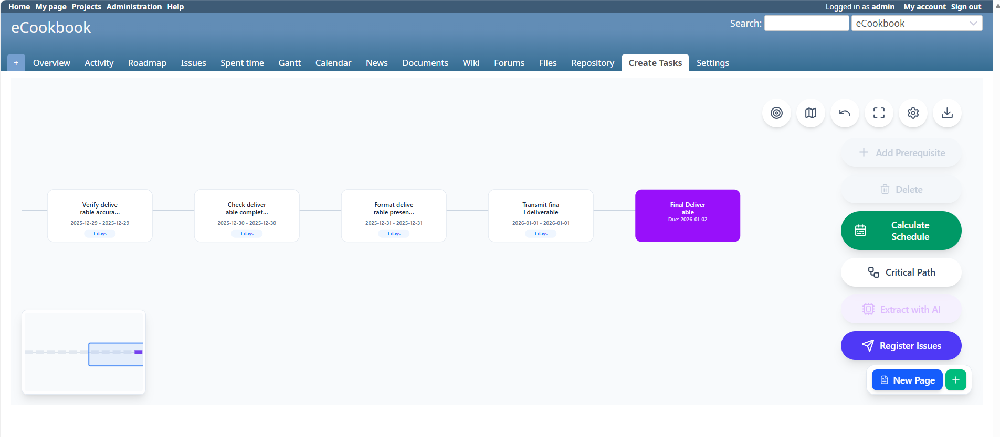

# Create Tasks Redmine Plugin

Create Tasks は、最終成果物から実行可能なタスクを分解し、依存関係を可視化して一括登録できる Redmine プラグインです。

## 機能

- マインドマップ形式でのタスク設計と前提（依存）設定
- AI によるタスク抽出（Gemini / Azure OpenAI）
- スケジュール計算とクリティカルパスの可視化
- 既定値付きのチケット一括登録
- 複数ページ管理・Undo・JSON エクスポート



## 必要要件

- Redmine
- Node.js / npm（フロントエンドのビルド用）

## インストール

1. **プラグインの配置**
   ```bash
   cd /path/to/redmine/plugins
   git clone <repository-url> create_tasks
   ```

2. **フロントエンド依存のインストール**
   ```bash
   cd create_tasks/frontend
   npm install
   ```

3. **フロントエンドのビルド**
   ```bash
   npm run build
   ```
   `assets/javascripts/spa.js` と `assets/stylesheets/spa.css` が生成されます。

4. **Redmine の再起動**

## 設定

1. **モジュール有効化**
   - プロジェクト設定 → モジュール → **Create Tasks** を有効化。

2. **権限**
   - ロールに `view_create_tasks` 権限を付与。
   - さらに通常の「チケット追加（Add issues）」権限も必要です。

3. **プラグイン設定**
   - 管理 → プラグイン → Create Tasks → 設定。
   - 設定項目: `ai_provider`, `ai_prompt`, `issue_tracker_id`。

4. **デフォルトプロンプト**
   - 推奨プロンプトは `lib/prompts/task_extraction_prompt.md` を参照。

## AI プロバイダー

### Gemini

必須の環境変数:

- `GEMINI_API_KEY`

任意:

- `GEMINI_MODEL`（既定: `gemini-2.5-flash`）

### Azure OpenAI

必須の環境変数:

- `AZURE_OPENAI_API_KEY`
- `AZURE_OPENAI_ENDPOINT`
- `AZURE_OPENAI_DEPLOYMENT`

任意:

- `AZURE_OPENAI_API_VERSION`（既定: `2024-02-15-preview`）

Redmine の起動環境（systemd や docker-compose など）に設定してください。

## 使い方

1. プロジェクトメニューの **Create Tasks** から画面を開きます。
2. マインドマップでタスクを作成し、依存関係や日付を整備します。
3. **AIでタスク抽出** を使って候補を生成し、必要に応じてチケット登録します。
4. 必要に応じて JSON をエクスポートします。

## 開発

- フロントエンド開発サーバー起動:
  ```bash
  cd create_tasks/frontend
  npm run dev
  ```
- 配置前にビルド:
  ```bash
  npm run build
  ```

## ライセンス

MIT License
